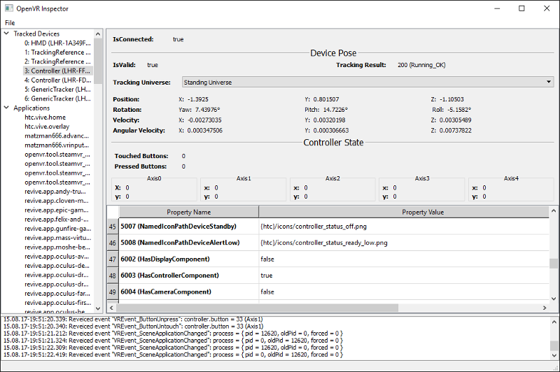

  

# OpenVR Inspector

OpenVR Inspector shows extensive information on all available OpenVR devices, on all installed OpenVR applications, and prints incoming OpenVR events. It has been mainly designed as development, debugging and trouble-shooting tool.

# Features

- Lists available OpenVR devices
  - Shows tracking state and pose
  - Shows controller state
  - Lists all device properties
- Lists installed OpenVR applications and their properties
- Listens to OpenVR events and prints them into a log window

# License

This software is released under GPL 3.0.
